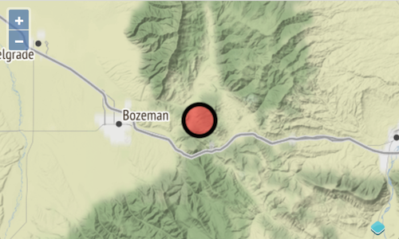

# Drawing a point at your location

Now that we have a map centered on our location, we also want to show the exact location by rendering a point at it.

## Adding a vector layer

In addition to displaying maps from tiles provided by a tile service, OpenLayers can render vector data. A vector layer has a source which contains features. In this simple example, we just add a single feature with a point geometry that represents our location.

A few more imports are required:

[import:'import-vector'](../../../src/en/examples/basics/point-feature.js)

The vector layer itself is created with the following code, which we place between the `const map` and `navigator.geolocation` blocks in our `main.js` file:

[import:'point-layer'](../../../src/en/examples/basics/point-feature.js)

We now can create a point feature and add it to the vector layer as soon as we know our location. This is done with a single line at the end of the `geolocation`'s' `getCurrentPosition` callback:

[import:'add-point'](../../../src/en/examples/basics/point-feature.js)

## Styling the point

To make the point of our location easier to see on the map, we can give the vector layer some style. This requires more imports to be added at the top of our `main.js`.

[import:'import-style'](../../../src/en/examples/basics/point-feature.js)

The code for adding the style can be added after the `VectorLayer` definition:

[import:'style'](../../../src/en/examples/basics/point-feature.js)

When done, the result should look like this:

