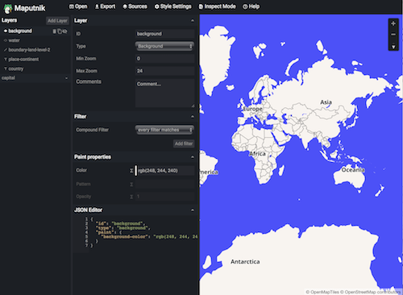
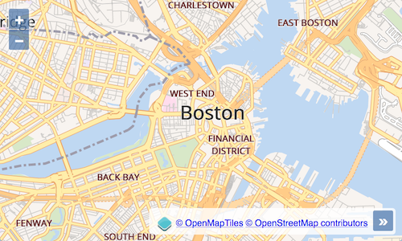

# Making things look bright

There have been many attempts to create tools and formats for styling maps. The most popular formats were probably SLD and CartoCSS. A graphical tool that comes to mind is Atlas Styler. But none of these format or tools were really convenient to use.

Mapbox finally came up with Mapbox Studio, a very user friendly style editor, and the Mapbox Style format. The Mapbox Style format is supported by a growing number of applications, and a graphical Open Source editor, [Maputnik](https://maputnik.github.io/), is available for creating and modifying Mapbox Style files.

The [ol-mapbox-style](https://npmjs.com/package/ol-mapbox-style/) package adds support for the Mapbox Style format to OpenLayers. Let's see if we can get a nicer looking map than the one from the [previous](ugly.md) exercise.

## Creating Mapbox Style files in Maputnik

You can play with a live instance of Maputnik at https://maputnik.github.io/editor/, or download and install it locally. I have created a file with our ugly style. You can download that file,  [ugly.json]({{book.workshopUrl}}/data/ugly.json), and open it in Maputnik to verify it looks just as ugly there as it does in our OpenLayers application:



## Create a map from a Mapbox Style in OpenLayers

We'll import the `apply` function from the [ol-mapbox-style](https://npmjs.com/package/ol-mapbox-style/) package, so we can simply have a map with all the contents from a style file rendered into our `map-container`. But first we need to install the package:

    npm install --save ol-mapbox-style

Now we can import the function into our `main.js`:

[import:'mapbox-style-import'](../../../src/en/examples/vectortile/bright.js)

We can also remove all other imports except for these two:

[import:'imports'](../../../src/en/examples/vectortile/bright.js)

While we are at cleaning up, we can also delete the `key`, `map`, `layer` definitions. And we can – of course – remove all the style code. Finally, in `index.html`, we can remove the line that adds the Open Sans font, and the `background-color` for the map.

Instead of the previous map code, we need a single line to create a map from our ugly Mapbox style, which we insert below our imports:

```js
const map = apply('map-container', './data/ugly.json');
```

This should give us the same ugly map as before, just with less application code. But hey, we wanted to make things look bright, and not look at an ugly map again. So let's open the 'OSM Bright' from Maputnik's Gallery Styles, and use that. I have prepared it already, and made the result available as {{book.workshopUrl}}/data/bright.json. So let's change the `apply()` line to

[import:'map'](../../../src/en/examples/vectortile/bright.js)

What a relief. Finally we can enjoy a nice looking world map, and zoom to Boston!



And note that our map is still interactive, meaning you get an info popup when you click on any geometry.
