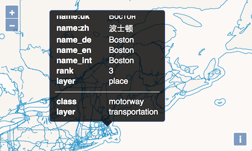

# Interact with VectorTile features

If we want to style the layer we just created, it would be nice to get some information about each geometry we see on the map. The nice thing about vector tile layers is that we can interact with them just like with vector layers. So it is easy to add a listener for clicks to the map, query the features at the clicked position, and display a popup with the attributes of each feature.

## Adding a popup

Like in the [Basics](../basics/popup.md) exercise, we create a popup by going to https://cssarrowplease.com/. This time I decided to create a darker popup. We add the css to the `<style>` section of our `index.html`:

[import:'popup-css'](../../../src/en/examples/vectortile/interact.html)

We are going to render scrollable HTML tables into our popup, so our markup for the popup also needs a `
` for the popup content:

[import:'popup-markup'](../../../src/en/examples/vectortile/interact.html)

To style the tables, we add some more style to the `<style>` section of `index.html`:

[import:'table-css'](../../../src/en/examples/vectortile/interact.html)

In the application's `main.js` import the `Overlay` class:

[import:'popup-import'](../../../src/en/examples/vectortile/interact.js)

Again in the application's `main.js`, we can now append the code for the popup's `Overlay`:

[import:'popup'](../../../src/en/examples/vectortile/interact.js)

To make it easy to close the popup so it does not cover other features we might want to click, we add a click listener to the overlay, so it closes when we click on it:

[import:'popup-close'](../../../src/en/examples/vectortile/interact.js)

Calling `setPosition()` on an overlay sets an undefined position, which causes the overlay to disappear.

## Fill the popup with feature attributes

Now it is time to connect the popup to a click listener on the map. We append more code at the bottom of `main.js`:

[import:'interact'](../../../src/en/examples/vectortile/interact.js)

By iterating through all the features we get at the clicked position (`map.forEachFeatureAtPixel`), we build a separate table for each feature. With each feature, we iterate through its properties (`feature.getProperties()`), and add a table row (`<tr>`) for each property. We also set a `hitTolerance` of `1` pixel to make it easier to click on lines.

## Using the interactivity to build a style for our map

Now we can click on any geometry in the map, and use the information we get in the popup to create styles in the [next](ugly.ms) exercise. Note that vector tile features have a special `layer` property, which indicates the source layer (i.e. the layer the feature belongs to in the vector tile's structure, which is a layer -> feature hierarchy).

