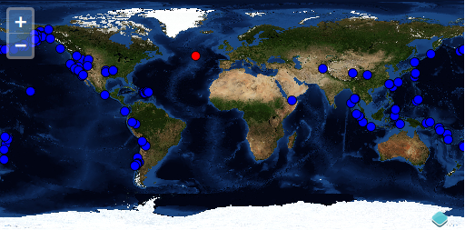

## Selecting Features

As we've seen in the layers module, we can pull features as vectors and draw them on top of a base map. One of the advantages of serving vector data is that users can interact with the data. In this example, we create a vector layer where users can select and view feature information.

The previous example demonstrated the use of an `ol.control.Control` on the map.  Controls have a visual representation on the map or add DOM elements to the document.  An `ol.interaction.Interaction` is responsible for handling user interaction, but typically has no visual representation.  This example demonstrates the use of the `ol.interaction.Select` for interacting with features from vector layers.

## Create a Vector Layer and a Select Interaction

### Tasks

1. Let's start with the vector layer example from a [previous section](../layers/vector.md).  Open `map.html` in your text editor and make sure it looks something like the following:

  ```html
  <!doctype html>
  <html lang="en">
    <head>
      <link rel="stylesheet" href="/ol.css" type="text/css">
      <style>
      #map {
        height: 256px;
        width: 512px;
      }
      </style>
      <script src="/loader.js" type="text/javascript"></script>
      <title>OpenLayers 3 example</title>
    </head>
    <body>
      <h1>My Map</h1>
      <div id="map"></div>
      <script type="text/javascript">
        var map = new ol.Map({
          interactions: ol.interaction.defaults().extend([
            new ol.interaction.Select({
              style: new ol.style.Style({
                image: new ol.style.Circle({
                  radius: 5,
                  fill: new ol.style.Fill({
                    color: '#FF0000'
                  }),
                  stroke: new ol.style.Stroke({
                    color: '#000000'
                  })
                })
              })
            })
          ]),
          target: 'map',
          layers: [
            new ol.layer.Tile({
              title: 'Global Imagery',
              source: new ol.source.TileWMS({
                url: 'http://maps.opengeo.org/geowebcache/service/wms',
                params: {LAYERS: 'bluemarble', VERSION: '1.1.1'}
              })
            }),
            new ol.layer.Vector({
              title: 'Earthquakes',
              source: new ol.source.Vector({
                url: '/data/layers/7day-M2.5.json',
                format: new ol.format.GeoJSON()
              }),
              style: new ol.style.Style({
                image: new ol.style.Circle({
                  radius: 5,
                  fill: new ol.style.Fill({
                    color: '#0000FF'
                  }),
                  stroke: new ol.style.Stroke({
                    color: '#000000'
                  })
                })
              })
            })
          ],
          view: new ol.View({
            projection: 'EPSG:4326',
            center: [0, 0],
            zoom: 1
          })
        });
      </script>
    </body>
  </html>
  ```        

1.  Save your changes to `map.html` and open the page in your browser:  {{ book.workshopUrl }}/map.html. To see feature selection in action, use the mouse-click to select an earthquake:

  
